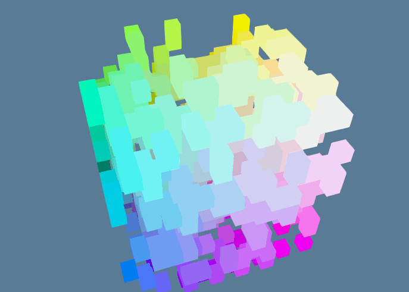

# wgpu-cellular-automata [WIP]

Making a 3D Celluar Automata to learn [wgpu](https://github.com/gfx-rs/wgpu) a cross-plaform graphics API.

Foundations of the code built off of [sotrh's tutorial](https://sotrh.github.io/learn-wgpu/#what-is-wgpu)

## Todo
- [x] Cubes
- [x] Compute Shader
- [ ] Better Camera Controls
- [ ] Configuration (camera poistion, ruleset, grid width)
- [ ] Aesthetic changes (Lighting, birth/death animation)
- [ ] WebGPU example

