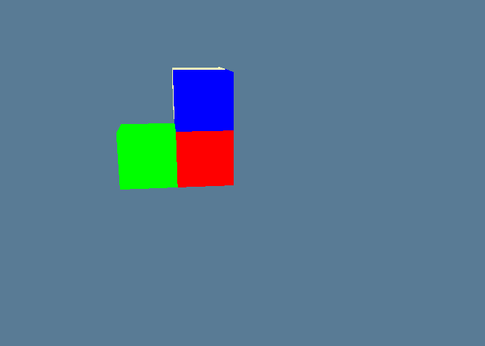

# wgpu-cellular-automata [WIP]

Learning this modern cross platform low level graphics API wgpu by making a 3D Ceullar Automaton with it.

Built off of [sotrh's wgpu tutorial](https://sotrh.github.io/learn-wgpu/#why-rust)

