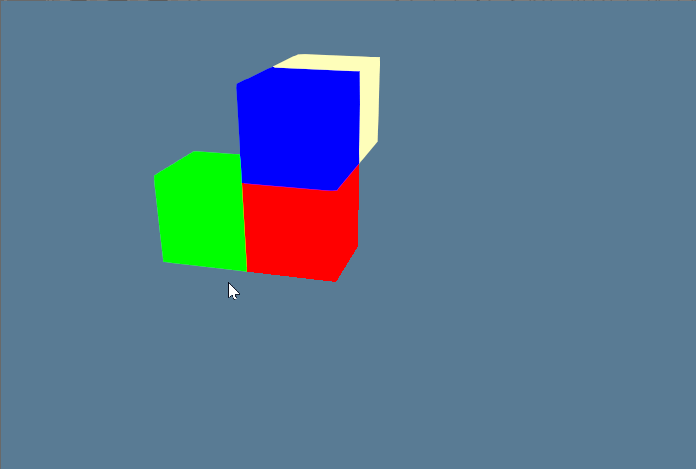

# wgpu-cellular-automata [WIP]

Making a 3D Celluar Automata to learn [wgpu](https://github.com/gfx-rs/wgpu) a cross-plaform graphics API.

Built off of [sotrh's wgpu tutorial](https://sotrh.github.io/learn-wgpu/#why-rust)

